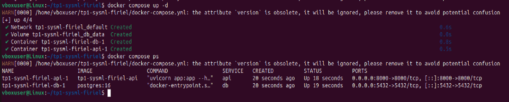

## CI1 Example

**Exercice n°1 : Installation de Docker et vérification de l’environnement**

**Question 1.a.** Vérifier l’installation Docker

.png)
.png)
.png)

Cela confirme que Docker Engine fonctionne correctement dans mon environnement Ubuntu sous WSL2.

**Question 1.b.** 

.png)

La sortie complète du conteneur hello-world qui s’exécute correctement.

**Question 1.c.**

.png)

Ce que représente cette liste :

- Chaque ligne correspond à un conteneur Docker.
- La colonne IMAGE indique l’image utilisée (ici hello-world).
- STATUS montre si le conteneur a tourné ou s’est arrêté.
- Docker génère un nom aléatoire lorsqu’on n’en fournit pas.
- Les conteneurs « Exited (0) » signifient qu’ils ont terminé correctement.

**Exercice 2 : Premiers pas avec Docker : images et conteneurs**

**Question 2.a** Différence entre une image Docker et un conteneur Docker

Dans Docker une image et un conteneur n’ont pas le même rôle. Une image Docker est un modèle statique, une sorte de blueprint qui contient tout l'environnement nécessaire, un système minimal, des dépendances, et parfois une application prête à fonctionner. L’image ne vit pas, elle ne fait rien tant qu’on ne la lance pas.

Un conteneur, au contraire est l’instance vivante de cette image. On peut voir ça comme une photo (l’image) et une copie imprimée qu’on manipule (le conteneur).\
Le conteneur exécute réellement le code, possède son système de fichiers éphémère et son propre cycle de vie démarrage, exécution, arrêt.

**Question 2.b** 

.png)

Que se passe-t-il après l'exécution de cette commande ? 

- Docker vérifie si l’image alpine est présente localement. Si elle n’y est pas, il la télécharge automatiquement depuis Docker Hub.
- Il crée un conteneur éphémère basé sur cette image.
- Il exécute immédiatement la commande : echo "Bonjour depuis un conteneur Alpine"
- Le conteneur s’arrête aussitôt après avoir affiché le texte, car il n’a plus rien à faire.

**Question 2.c**

.png)

Pourquoi ?\
Parce que le conteneur n’avait qu’une seule instruction à exécuter (echo "Bonjour depuis un conteneur Alpine"). Une fois la commande terminée, Docker stoppe automatiquement le conteneur.\
Dans Docker un conteneur qui n’a plus de processus actif s’arrête immédiatement ce qui est normal.

**Question 2.d**

.png)

Pour ls j’obtiens une liste de fichiers : bin, dev, etc, home, lib, media, mnt, opt, proc, root, run, sbin, srv, sys, tmp, usr, var

Pour uname -a elle affiche les informations système, notamment le noyau Linux, l’architecture (x86\_64) et une version minimale du système. Cela confirme qu’on est bien dans un OS différent de celui de la machine hôte, mais isolé grâce au conteneur Docker.

Pour exit elle ferme le shell interne, ce qui provoque immédiatement l’arrêt du conteneur.

**Exercice 3 : Construire une première image Docker avec une mini-API FastAP**

**Étape 1 — Compléter le fichier app.py**

**Question 3.a** 

Le code complété :

.png)

**Explications de code :** FastAPI() permet de créer l’API. Pour @app.get("/health") permet de définir une route HTTP GET qui répond à /health. Et enfin la fonction health() renvoie un dictionnaire python qui sera automatiquement converti en JSON par FastAPI.

**Étape 2 — Compléter le Dockerfile**

**Question 3.b.** 

Le Dockerfile complété :
.png)

Explications de code :

- FROM python:3.11-slim c’est l’image légère de Python 3.11 pour réduire la taille du conteneur.
- WORKDIR /app : définit le répertoire de travail où les commandes suivantes s’exécuteront.
- COPY app.py /app/ : copie le fichier d’API dans le conteneur.
- RUN pip install fastapi uvicorn : installe les packages nécessaires à l’API.
- CMD ["uvicorn", "app:app", "--host", "0.0.0.0", "--port", "8000"] : commande exécutée lorsque le conteneur démarre pour lancer le serveur FastAPI sur le port 8000.

À partir de cette étape, j’ai choisi de basculer de l’environnement WSL2 vers une machine virtuelle Linux sous VirtualBox, car j’ai rencontré des problèmes de résolution DNS avec WSL2 (j’ai refait les mêmes étapes précédentes).

**Étape 3 — Construire l'image Docker**

**Question 3.c.**
.png)

L’image s’est bien construite. Docker a téléchargé l’image de base python:3.11-slim, créé le répertoire de travail, copié le fichier app.py, installé FastAPI et Uvicorn et finalement généré l’image finale simple-api:latest.

.png)

**Exercice 4 — Exécuter l’API FastAPI dans un conteneur Docker**

**Étape 1 — Lancer le conteneur** 

**Question 4.a** 

.png)

L’option -p 8000:8000 sert à rediriger le port 8000 du conteneur vers le port 8000 de ma machine.\
**Étape 2 — Tester l’endpoint /health**

**Question 4.b** 

.png)

.png)

L’API a répondu correctement avec le JSON attendu 

**Étape 3 — Observer les conteneurs en cours d’exécution**

**Question 4.c**

.png)

Nom du conteneur : magical\_lehmann

Image utilisée : simple-api

Port mappé : 0.0.0.0:8000->8000/tcp, [::]:8000->8000/tcp

Cela confirme que l’API tourne correctement dans le conteneur Docker.

**Étape 4 — Arrêter le conteneur** 

**Question 4.d.**

.png)

docker ps n'affiche plus le conteneur (il ne tourne plus) : 

.png)

mais docker ps -a le montre toujours, car il existe encore mais à l’état Exited :

.png)

La différence entre les deux commandes est que docker ps affiche uniquement les conteneurs en cours d’exécution, et docker ps -a (avec l'option -a pour "all") affiche tous les conteneurs, y compris ceux arrêtés.

**Exercice 5 : Démarrer un mini-système multi-conteneurs avec Docker Compose**

**Étape 1 — Préparer la structure des fichiers** 

**Question 5.a.**

.png)

**Étape 2 — Compléter le fichier docker-compose.yml**

**Question 5.b.** 

.png)

Rq : Volume ajouté pour persister les données

**Étape 3 — Démarrer la stack avec Docker Compose** 

**Question 5.c.**

.png)

.png)

Observation : Les services db et api apparaissent bien comme “Up”, ce qui signifie qu’ils sont démarrés et prêts à être utilisés.

**Étape 4 — Tester à nouveau l’endpoint /health** 

**Question 5.d.**

.png)

Cela confirme que l’API fonctionne et que la communication entre le conteneur et ma machine est correcte.

**Étape 5 — Arrêter proprement les services** 

**Question 5.e.**

.png)

La différence entre :

- docker compose down arrête tous les services et supprime les conteneurs créés par Compose.
- docker stop <id> ne fait qu’arrêter un seul conteneur sans le supprimer.

**Exercice 6 : Interagir avec la base de données PostgreSQL dans un conteneur**

**Étape 1 — Se connecter au conteneur PostgreSQL** 

**Question 6.a**

.png)

Explication des options :

- exec : exécute une commande dans un conteneur déjà en cours d’exécution.
- db : le nom du service (conteneur) dans lequel je veux entrer.
- -U demo : se connecter avec l’utilisateur demo.
- -d demo : se connecter à la base de données demo.

**Étape 2 — Exécuter quelques commandes SQL simples** 

**Question 6.b.**

.png)

Observation : Affiche la version de PostgreSQL utilisée dans le conteneur.

.png)

Observation : Affiche le nom de la base de données actuellement utilisée qui est demo.

**Étape 3 — Comprendre la connexion depuis d'autres services** 

**Question 6.c.**

Si un autre service Docker par exemple l’API veut se connecter à PostgreSQL :

- Hostname à utiliser : db (nom du service défini dans docker-compose.yml)
- Port : 5432 (port par défaut de PostgreSQL)
- Utilisateur / mot de passe : demo / demo
- Nom de la base : demo

Cela permet à l’API ou à tout autre conteneur de communiquer directement avec la base PostgreSQL sans exposer le port vers l’extérieur.

**Étape 4 — Nettoyer** 

**Question 6.d.**

.png)

Explication : Cette commande arrête et supprime les conteneurs créés par Docker Compose, mais les volumes de données restent donc la base n’est pas effacée. Pour supprimer également les volumes et nettoyer toutes les données persistantes, il faut ajouter à la commande l’option -v. La conséquence de l’option -v est que les données stockées dans PostgreSQL sont perdues définitivement.

**Exercice 7 : Déboguer des conteneurs Docker : commandes essentielles et bonnes pratiques**

**Étape 1 — Afficher les logs d’un service** 

**Question 7.a.**

.png)

.png)

**Étape 2 — Entrer dans un conteneur en cours d’exécution** 

**Question 7.b.**

.png)

- La commande ls montre que app.py est bien présent, et la commande python --version confirme que Python 3.11 est installé.

**Étape 3 — Redémarrer un service** 

**Question 7.c.**

.png)

Après le redémarrage l’API reste accessible sur /health.

Quelles situations un redémarrage est utile ?

- Après modification de configuration ou variables d’environnement.
- Pour résoudre un blocage temporaire ou un problème de connexion réseau.

.png)

**Étape 4 — Conteneur qui ne démarre pas : diagnostic** 

**Question 7.d**

.png)

.png)

.png)

.png)

.png)

**La cause :** NameError: name 'app' is not defined. Did you mean: 'appi'?

Les logs montrent une erreur de type ModuleNotFoundError ou ImportError, ce qui m’a permis d’identifier que le nom du module était incorrect.

La reconstruction de l’image est nécessaire à chaque modification du code pour que les changements soient pris en compte.

**Étape 5 — Supprimer des conteneurs et images** 

**Question 7.e.**

.png)

Le nettoyage régulier est utile car il évite l’accumulation d’anciennes images et de conteneurs inutiles, libère de l’espace disque, facilite la gestion des versions et réduit les risques de conflit entre images.

**Exercice 8 : Questions de réflexion et consignes pour le rendu**

**Questions de réflexion** 

**Question 8.a.**

Un notebook Jupyter est très pratique pour le prototypage et l’exploration des données. Il permet d’expérimenter rapidement, de visualiser les résultats et de tester différentes idées. Cependant, il présente plusieurs limites pour la mise en production.

La reproductibilité est l’un des principaux problèmes. Les cellules peuvent être exécutées dans un ordre aléatoire et certaines variables ou dépendances peuvent ne pas être clairement définies. Cela rend difficile de recréer exactement le même environnement et d’obtenir les mêmes résultats de manière fiable.

De plus, Jupyter n’est pas conçu pour l’automatisation ou l’intégration dans un service web. Il est compliqué d’exposer un modèle via une API ou de gérer plusieurs services interconnectés directement depuis un notebook.

Pour ces raisons, pour la production il est préférable de mettre le modèle dans un script Python ou dans une application comme FastAPI et de le conteneuriser. Cela garantit un environnement stable, reproductible et facilement déployable.

**Question 8.b.**

Docker Compose est un outil qui permet de gérer plusieurs conteneurs et services avec un seul fichier de configuration. Pendant ce TP, j’ai pu observer son utilité concrète. Il m’a permis de lancer simultanément l’API FastAPI et la base de données PostgreSQL avec une seule commande. Les conteneurs se sont correctement connectés entre eux sans configuration complexe supplémentaire.

Un autre avantage est la reproductibilité de l’environnement complet. Docker Compose permet de définir les versions exactes des images, les ports exposés, les volumes de données et les dépendances entre services. Cela facilite grandement la mise en place d’un environnement identique sur différentes machines.

En conclusion, Docker Compose simplifie la gestion et le déploiement d’architectures multi-services. C’est un outil indispensable pour les systèmes de Machine Learning en production.
