## CI2 : Ingestion mensuelle, validation et snapshots

**Exercice 1 : Mise en place du projet et du rapport**
**Question 1.a.**

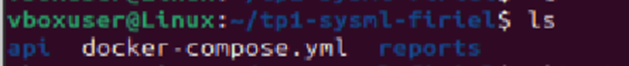

État initial du dépôt : 
vboxuser@Linux:~/tp1-sysml-firiel$ git status
On branch main
Your branch is ahead of 'origin/main' by 1 commit.
  (use "git push" to publish your local commits)

nothing to commit, working tree clean

**Question 1.b.**
Structure des répertoires du TP2 : 
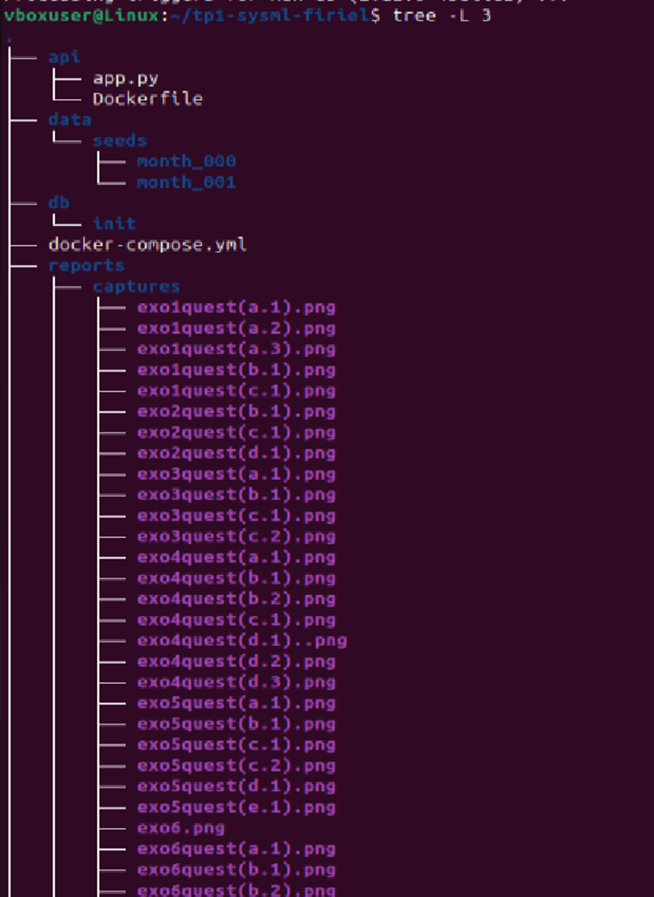
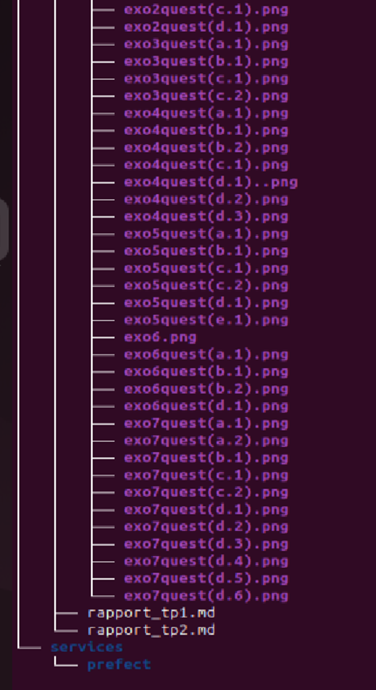

**Question 1.c.**
Après le téléchargement, J'ai vérifié la présence des fichiers avec :
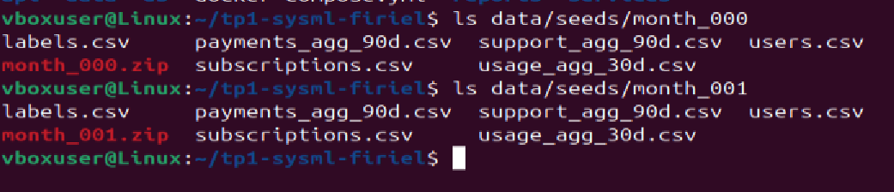

Structure des données (month_000 et month_001) :

vboxuser@Linux:~/tp1-sysml-firiel$ ls data/seeds/month_000
labels.csv     
payments_agg_90d.csv  
support_agg_90d.csv  
users.csv
month_000.zip  
subscriptions.csv     
usage_agg_30d.csv

vboxuser@Linux:~/tp1-sysml-firiel$ ls data/seeds/month_001
labels.csv   
payments_agg_90d.csv  
support_agg_90d.csv  
users.csv
month_001.zip  
subscriptions.csv     
usage_agg_30d.csv  

**Exercice 2 : Base de données et docker-compose**
**Question 2.a.**
Le fichier db/init/001_schema.sql a été créé et contient le schéma PostgreSQL fourni.

**Question 2.b.** 
Le fichier .env sert à stocker les variables d’environnement injectées automatiquement dans Docker, comme les identifiants PostgreSQL.

**Question 2.c.**
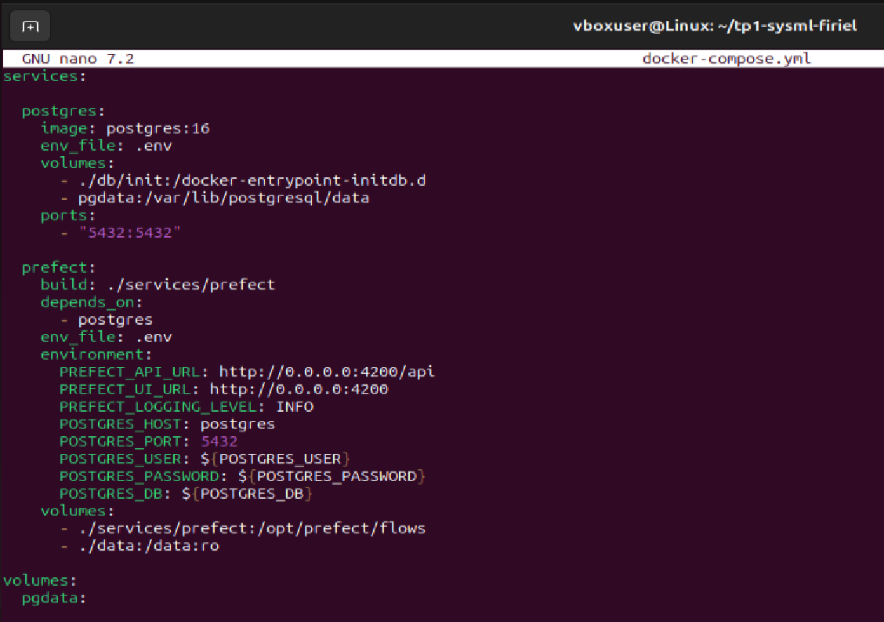
Le fichier docker-compose.yml a été mis à jour avec les services postgres et prefect.

**Question 2.d.** 
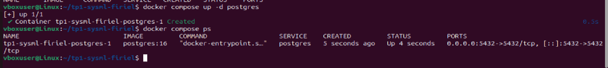

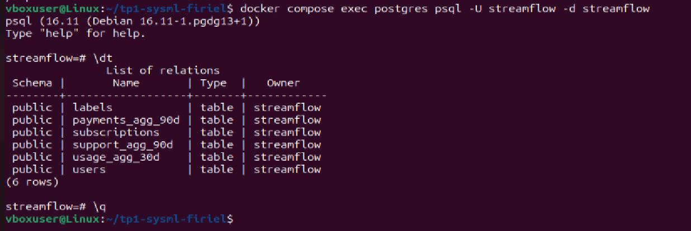

users : contient les informations d’inscription et caractéristiques utilisateurs.
subscriptions : contient les informations d’abonnement et de facturation.
usage_agg_30d : métriques d’usage sur 30 jours.
payments_agg_90d : historique de paiements (90 jours).
support_agg_90d : tickets support et résolutions.
labels : étiquette de churn.

**Exercice 3 : Upsert des CSV avec Prefect (month_000)**
**Question 3.a.**
Explication : le conteneur Prefect sert à orchestrer le pipeline d’ingestion, il exécute les flows et les tâches de manière automatisée, permettant de charger les CSV dans PostgreSQL et de gérer la planification des tâches.

**Question 3.b.**
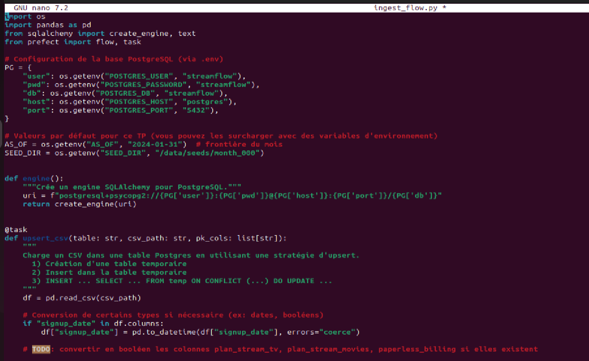
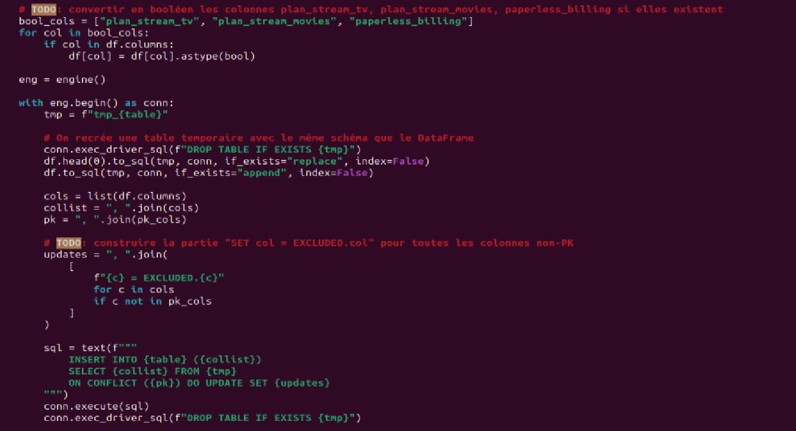
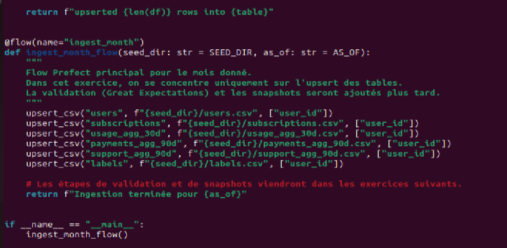
La fonction upsert_csv lit un CSV, crée une table temporaire, puis effectue un INSERT ... ON CONFLICT DO UPDATE pour insérer ou mettre à jour les lignes existantes dans PostgreSQL. Elle gère également la conversion de certaines colonnes en booléen.

**Question 3.c.**

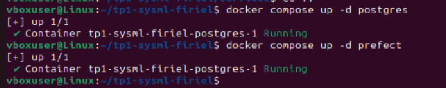
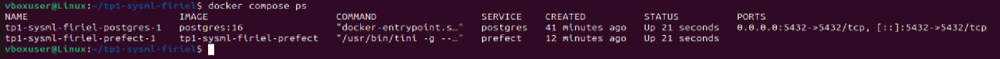
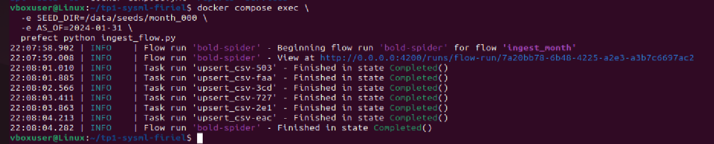
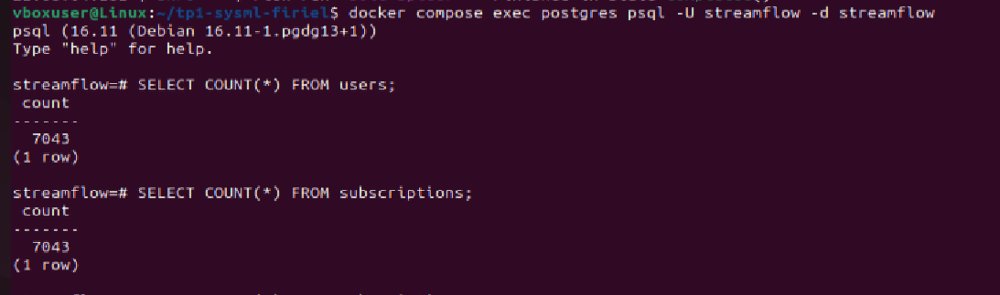

Après ingestion du mois month_000, la base PostgreSQL contient 7043 utilisateurs.
La table users compte 7043 lignes et la table subscriptions en compte également 7043, ce qui indique que l’ensemble des clients du mois a bien été chargé.

**Exercice 4 : Validation des données avec Great Expectations**
**Question 4.a.**
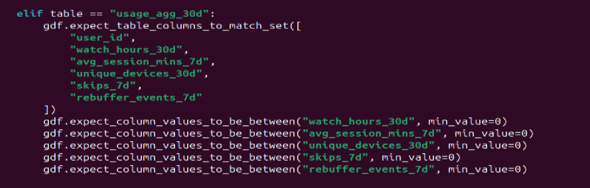

La fonction validate_with_ge applique des règles Great Expectations sur les données juste après les opérations d’upsert. Pour chaque table elle vérifie la présence des colonnes attendues et contrôle que certaines valeurs respectent des contraintes logiques (par exemple : valeurs ≥ 0). Si une expectation échoue le flow Prefect s’arrête automatiquement. Cela sert de garde-fou pour détecter des fichiers CSV corrompus ou incohérents avant de poursuivre les étapes suivantes du pipeline.

**Question 4.b.**

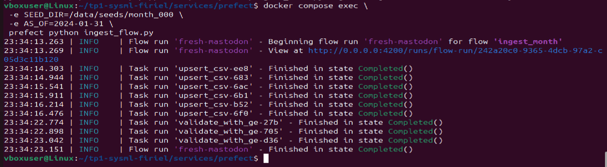

**Question 4.c.**

Exemples d’expectations pour usage_agg_30d :

gdf.expect_column_values_to_be_between("watch_hours_30d", min_value=0)
gdf.expect_column_values_to_be_between("avg_session_mins_7d", min_value=0)
gdf.expect_column_values_to_be_between("unique_devices_30d", min_value=0)
gdf.expect_column_values_to_be_between("skips_7d", min_value=0)
gdf.expect_column_values_to_be_between("rebuffer_events_7d", min_value=0)

Pourquoi ces bornes ?
Pour usage_agg_30d, j’ai ajouté des bornes comme watch_hours_30d >= 0 ou avg_session_mins_7d >= 0.
Ces valeurs représentent des durées ou des comptages, elles ne peuvent donc jamais être négatives.
Ces règles permettent de bloquer immédiatement un fichier contenant des valeurs impossibles (ex : durées négatives) ou un export défectueux. Cela protège le futur modèle de machine learning en empêchant l’entraînement sur des données incohérentes qui pourraient fausser les métriques ou les prédictions.

Comment ces règles protègent le modèle :

- Elles assurent l’intégrité des données avant l’entraînement.
- Elles détectent les exports corrompus ou incomplets dès la phase d’ingestion.
- Elles empêchent que le modèle apprenne sur des valeurs aberrantes, ce qui pourrait fausser les scores ou générer des prédictions erronées.
- Elles servent de garde-fou automatique dans le pipeline, garantissant que seules des données réalistes et cohérentes sont utilisées.

**Exercice 5 : Snapshots et ingestion month_001**
**Question 5.a.**

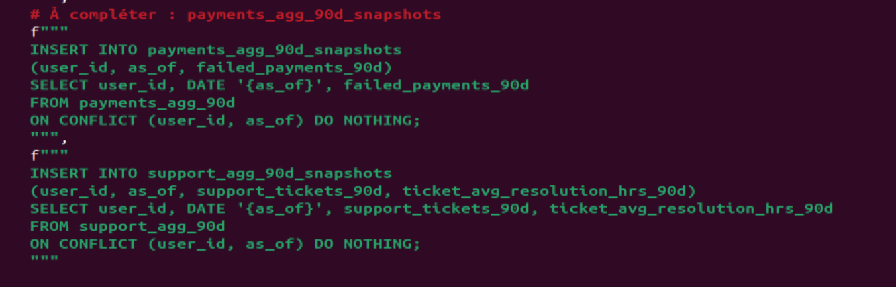
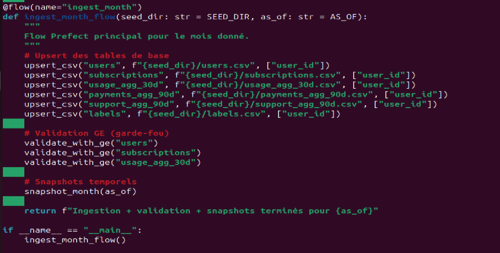

La fonction snapshot_month(as_of) crée des copies temporelles des tables critiques (subscriptions, usage, payments, support) pour la date as_of. Ces snapshots permettent de figer l’état des données à la fin de chaque mois, assurant la reproductibilité et la cohérence des analyses et modèles ultérieurs.

**Question 5.b.**
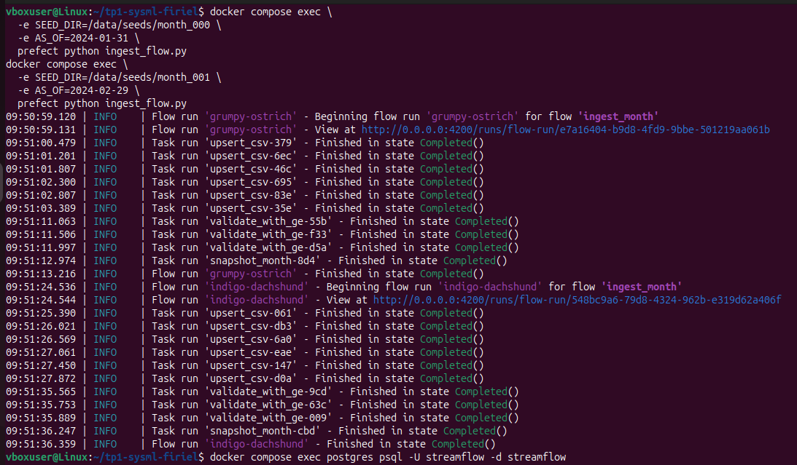
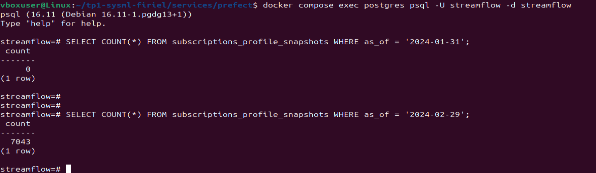 #a changer 

Pour le mois du 2024-01-31, 7043 lignes ont été créées dans subscriptions_profile_snapshots. Pour le mois du 2024-02-29, 7043 lignes ont également été insérées, indiquant que le même nombre d'utilisateurs est présent dans les deux mois. Aucun nouvel utilisateur n'a été ajouté entre janvier et février. Ces snapshots permettent de figer l'état des données à une date donnée et de comparer les états mensuels des utilisateurs sans altérer les tables live.

**Question 5.c.**

Schéma ASCII du pipeline complet :

CSV Seeds
   │
   ▼
Upsert CSV → Tables Live (users, subscriptions, usage, payments, support)
   │
   ▼
Validation Great Expectations
   │
   ▼
Snapshots mensuels (tables *_snapshots avec as_of)
   │
   ▼
Utilisation pour analyses ou modèles ML

Explications :
- On ne travaille pas directement sur les tables live pour entraîner un modèle afin de ne pas modifier les données sources et éviter des erreurs dans le flux de production.
- Les snapshots permettent d’éviter la data leakage et de garantir la reproductibilité temporelle,  chaque snapshot correspond exactement aux données disponibles à la fin du mois. 

Réflexion personnelle :
- La partie la plus difficile a été de maîtriser les INSERT idempotents (ON CONFLICT DO NOTHING) pour créer des snapshots sans doublons.
- Les erreurs rencontrées étaient surtout des conflits de clé primaire ou des tables inexistantes, elles ont été corrigées en s’assurant que le DDL de création des tables était exécuté avant les INSERT et que les clés primaires étaient correctement définies.

**Question 5.d.**
