## CI3 : Introduction à Feast et au Feature Store pour StreamFlow

**EXERCICE 1 — TP3 : Setup initial, rapport et balisage Git**
**Question 1.c**
# Contexte

Dans les TP précédents, nous avons mis en place l’ingestion des données StreamFlow, la validation via Great Expectations ainsi que la génération de snapshots mensuels pour plusieurs tables : utilisateurs, abonnements, usage, paiements et support. Ces tables contiennent des valeurs agrégées à deux périodes différentes, ce qui nous permet déjà d’analyser l’évolution du comportement des clients.

L’objectif du TP3 est de connecter ces données au Feature Store Feast afin de préparer l’entraînement futur du modèle de churn. Nous allons définir l’entité centrale (user), configurer les DataSources et FeatureViews, récupérer des features en mode offline et online, puis exposer un endpoint FastAPI capable de fournir les features d’un utilisateur en production. Ce TP marque la transition entre la simple ingestion de données et leur exploitation réelle pour le Machine Learning.

**EXERCICE 2 — Ajout de Feast à l’architecture Docker**
**Question 2.a**

**Question 2.b**
docker-compose.yml complet avec le service feas: 
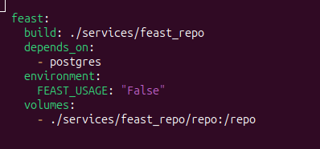

build: pointe vers ./services/feast_repo
volumes: monte ./services/feast_repo/repo dans /repo dans le conteneur

***Question 2.c**

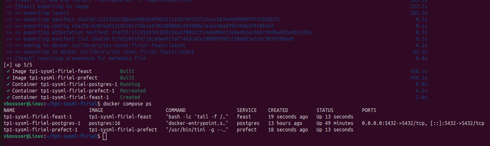

Pour vérifier que Feast voit le repo : 
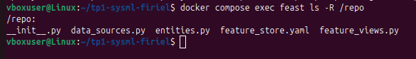

**Question 2.d**
# Mise en place de Feast

Commande utilisée pour démarrer les services : 
$ docker compose up -d --build
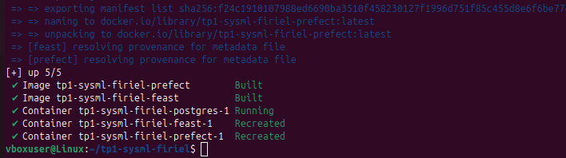

Le conteneur feast contient toute la configuration du Feature Store située dans /repo (monté depuis services/feast_repo/repo).
C’est dans ce dossier que se trouvent le fichier principal feature_store.yaml, les entités, les data sources et les FeatureViews.

Nous utiliserons ce conteneur pour exécuter les commandes Feast, par exemple :

- docker compose exec feast feast apply pour créer ou mettre à jour le registre (registry.db)
- docker compose exec feast feast materialize pour pousser les features dans l’online store
- docker compose exec feast feast get features pour tester les récupérations online/offline

Le conteneur Feast agit donc comme l’environnement isolé où tout le Feature Store de StreamFlow est défini et exécuté.

**EXERCICE 3 — Définition de l’Entity, des DataSources et des FeatureViews**

# Définition du Feature Store
**Question 3.a**
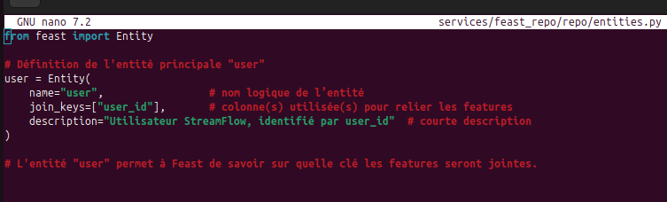

Une Entity dans Feast correspond à l’objet métier pour lequel on définit des features.
Dans notre cas, user_id est un bon choix de clé de jointure car toutes nos tables de snapshots (users, subscriptions, usage, paiements, support) l’utilisent comme identifiant unique. Cela garantit la cohérence et la traçabilité des features.

**Question 3.b**
le fichier services/feast_repo/repo/data_sources.py :
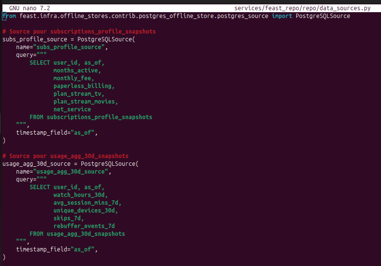
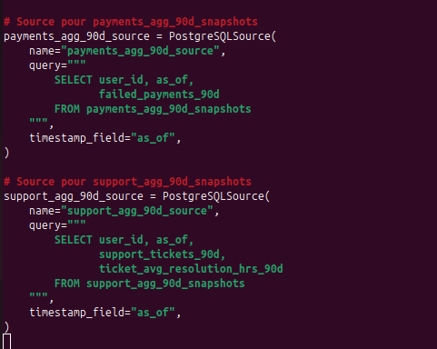

Chaque PostgreSQLSource correspond à une table de snapshots.
Par exemple usage_agg_30d_snapshots contient les colonnes watch_hours_30d, avg_session_mins_7d, unique_devices_30d, skips_7d, rebuffer_events_7d.
Le champ timestamp_field="as_of" est essentiel pour que Feast puisse effectuer les jointures temporelles correctes.

**Question 3.c**
services/feast_repo/repo/feature_views.py : 
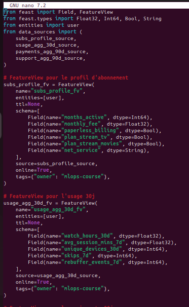
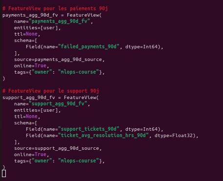

Exécution de conteneur Feast :
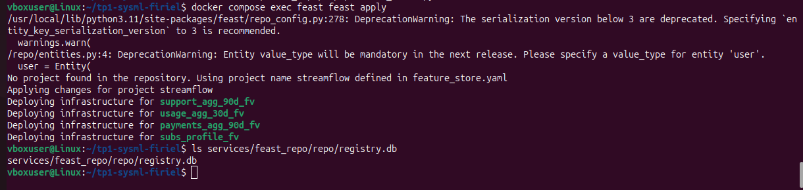
La commande se termine sans erreur et le fichier registry.db est apparu dans services/feast_repo/repo/.

def : La commande feast apply crée ou met à jour le registry.db, qui contient toutes les définitions d’entities, de sources et de FeatureViews. Elle permet de versionner et d’activer officiellement nos features pour l’entraînement et la production.

**EXERCICE 4 — Utilisation offline et online des features (Feast + API)**

**Question 4.a**
le répertoire data/processed existe.
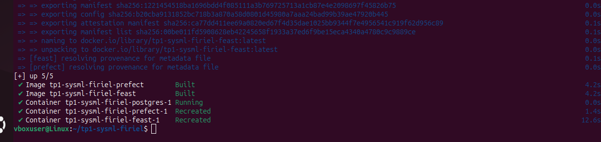

**Question 4.b** 
services/prefect/build_training_dataset.py : 
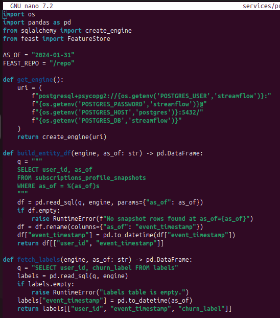
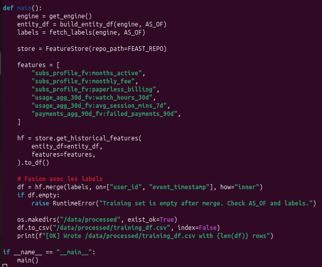

**Question 4.c**
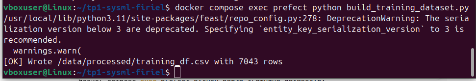

Vérifie que le fichier a été créé : 

Affiche les 5 premières lignes
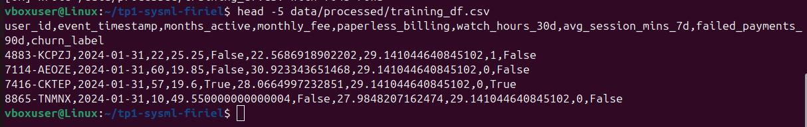

Commande utilisée :
$ docker compose exec prefect python build_training_dataset.py
Aperçu des 5 premières lignes du fichier training_df.csv :
| user_id | event_timestamp | months_active | monthly_fee | paperless_billing | watch_hours_30d | avg_session_mins_7d | failed_payments_90d | churn_label |
|---------|-----------------|---------------|-------------|-------------------|-----------------|---------------------|---------------------|-------------|
| 4883-KCPZJ | 2024-01-31 | 22 | 25.25 | False | 22.57 | 29.14 | 1 | False |
| 7114-AEOZE | 2024-01-31 | 60 | 19.85 | False | 30.92 | 29.14 | 0 | False |
| 7416-CKTEP | 2024-01-31 | 57 | 19.6 | True | 28.07 | 29.14 | 0 | True |
| 8865-TNMNX | 2024-01-31 | 10 | 49.55 | False | 27.98 | 29.14 | 0 | False |

**Question 4.d**
Feast garantit la point-in-time correctness en utilisant :
- La colonne as_of dans chaque DataSource comme référence temporelle (timestamp_field).
- La colonne event_timestamp dans entity_df qui indique pour chaque utilisateur la date de récupération.
Ainsi, seules les features disponibles à cette date sont extraites, évitant les fuites de données futures. 

**Question 4.e**
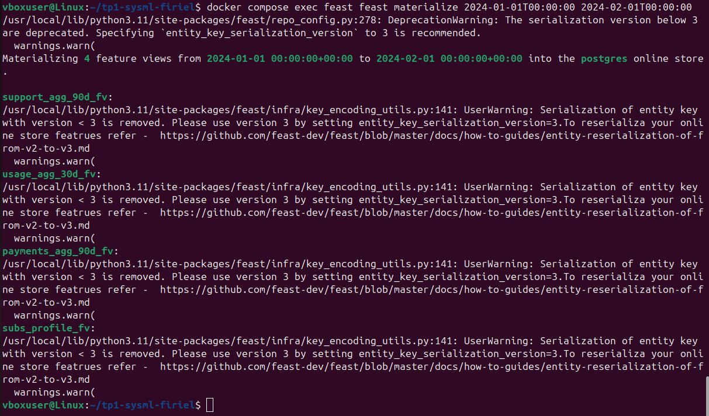

**Question 4.f**
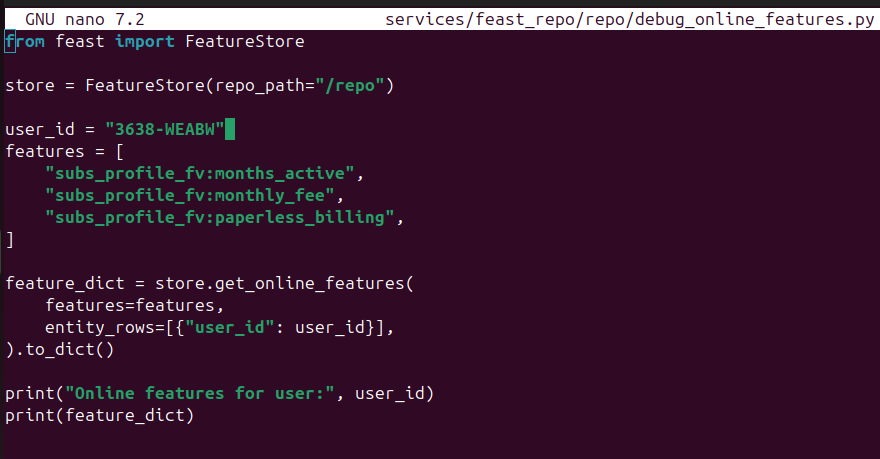

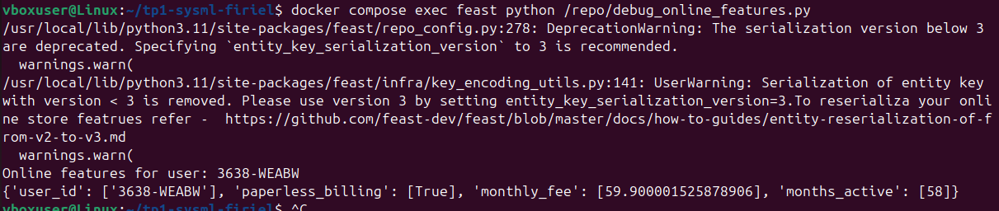

sortie : 
Online features for user: 3638-WEABW
{'user_id': ['3638-WEABW'], 'paperless_billing': [True], 'monthly_fee': [59.900001525878906], 'months_active': [58]}

**Question 4.h**
j'ai mis à jour docker-compose.yml, Dockerfile et requirements.txt. Et j'ai lancé $ docker compose up -d --build.
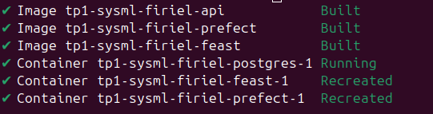

**Question 4.i**
contenu de fichier api/app.py : 
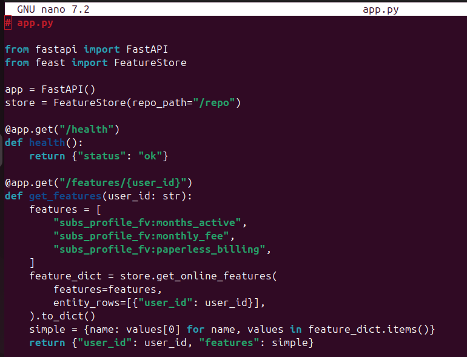

**Question 4.j**
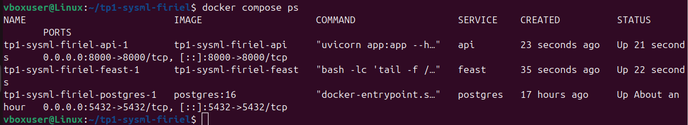
le service api est bien démarré.

Testez l’endpoint /health:
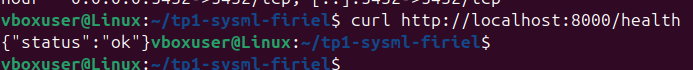

# Récupération offline & online
Interrogez l’endpoint /features/{user_id} : 
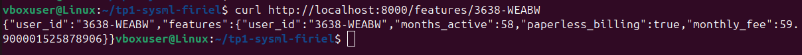

curl http://localhost:8000/features/3638-WEABW
{"user_id":"3638-WEABW","features":{"user_id":"3638-WEABW","months_active":58,"paperless_billing":true,"monthly_fee":59.900001525878906}}

**Question 4.k**
# Réflexion
L’endpoint /features/{user_id} permet de récupérer les mêmes features que celles utilisées pour l’entraînement.
Cela centralise la logique de calcul des features et réduit le training-serving skew, car la production et l’entraînement utilisent exactement les mêmes sources et transformations.

