## CI4 : Entraînement end-to-end : MLfow Registry → API de prédiction

**Exercice 1 : Mise en route + sanity checks**
**Question 1.a**
### Démarrage de la stack existante

La stack Docker issue du TP3 a été démarrée avec la commande :

$docker compose up -d

La commande $docker compose ps confirme que les services PostgreSQL, Feast,
Prefect et l’API FastAPI démarrent sans erreur : 

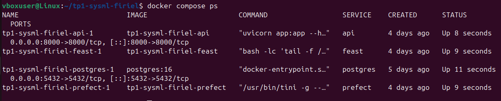

**Question 1.b**
### Ajout du service MLflow

Aprés rédemarrage de stack avec :

docker compose down
docker compose up -d --build

Le service mlflow est accessible sur le port 5000 : 

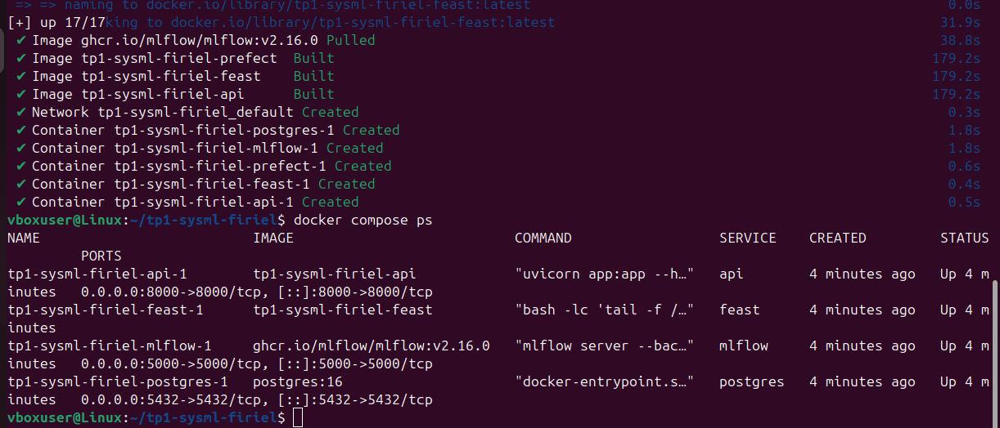

**Question 1.c**
### Vérification des interfaces

- MLflow UI est accessible via http://localhost:5000 : 

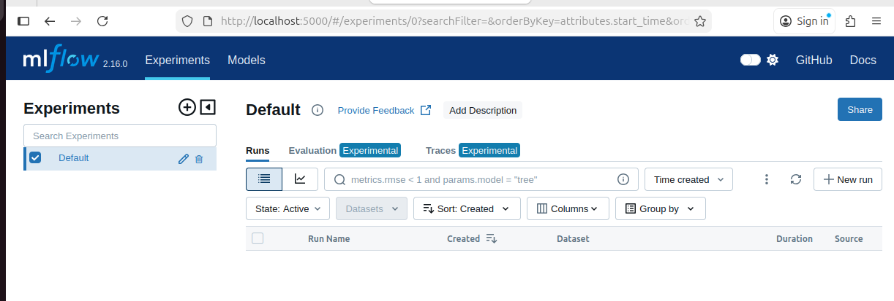

- L’API FastAPI répond correctement sur l’endpoint /health :
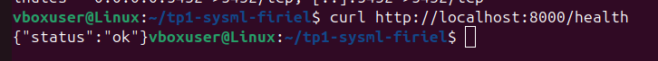

**Question 1.d**
curl http://localhost:8000/features/0001 : 
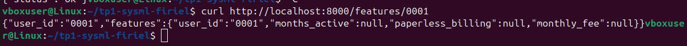

Les valeurs retournées montrent que l’Online Store est opérationnel.

**Question 1.e**
### 1. Commandes utilisées

Les commandes suivantes ont été utilisées pour démarrer et vérifier la stack :

docker compose up -d
docker compose ps

docker compose down
docker compose up -d --build

curl http://localhost:5000
curl http://localhost:8000/health
curl http://localhost:8000/features/0001

### 2. Preuve d’accessibilité des services 

MLflow UI est accessible via un navigateur à l’adresse http://localhost:5000 et l’interface MLflow s’affiche correctement.

API FastAPI
Vérification du endpoint de santé avec curl http://localhost:8000/health nous donne : {"status":"ok"}

Pour Feature Store (Feast – online store) on a Vérifié la récupération des features online avec curl http://localhost:8000/features/0001 et la réponse contient les features de l’utilisateur, ce qui confirme que Feast
et l’Online Store fonctionnent correctement.
 
### 3. Composants en cours d’exécution et leur rôle

Les composants suivants sont actifs dans la stack StreamFlow :

PostgreSQL : stocke les données sources et les snapshots temporels utiliséscomme base des features.

Feast : agit comme Feature Store, permettant la récupération des features en mode offline pour l’entraînement et online pour le serving.

FastAPI : expose une API permettant d’accéder aux features et servira ensuite les prédictions du modèle.

MLflow : assure le suivi des entraînements (paramètres, métriques, artefacts) et la gestion des versions de modèles via le Model Registry.

**Exercice 2 : Créer un script d’entraînement + tracking ML�ow (baseline RandomForest)**
**Question 2.a**
fichier train_baseline.py complet.

**Question 2.b**
Résultat attendu :
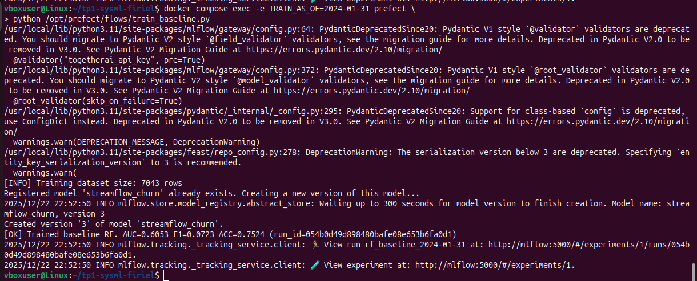
la commande se termine avec un message [OK] et run_id.

**Question 2.c**
### Entraînement baseline RandomForest

- **AS_OF utilisé** : 2024-01-31
- **Nombre de lignes du dataset** : 7043 rows lignes après merge features + labels
- **Colonnes catégorielles détectées** :
  - net_service
- **Métriques de validation** :
  - AUC : 0.6052844311377246
  - F1-score : 0.07234042553191489
  - Accuracy : 0.7524134014764339
- **Temps d’entraînement** : 1.8390228748321533 secondes

**Question 2.d**
Dans un pipeline MLOps orienté reproductibilité, fixer la valeur de AS_OF permet de garantir que les données d’entraînement correspondent toujours au même instant temporel, évitant ainsi toute fuite de données futures (data leakage). Cela assure que les features récupérées via Feast sont point-in-time correctes.

De la même manière, fixer le random_state garantit que les étapes aléatoires du pipeline (séparation train/validation, construction des arbres du RandomForest) produisent toujours les mêmes résultats. Cela permet de comparer objectivement les expériences MLflow et de reproduire un entraînement à l’identique en cas de besoin.

**Exercice 3 – Explorer MLflow et promouvoir un modèle**
**Question 3.a**
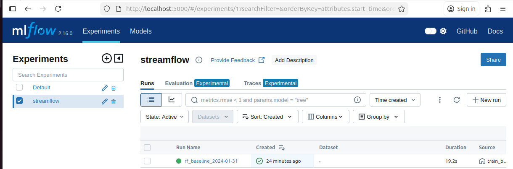

**Question 3.b**
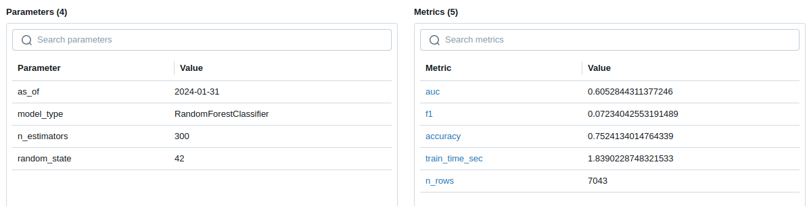

**Question 3.c**
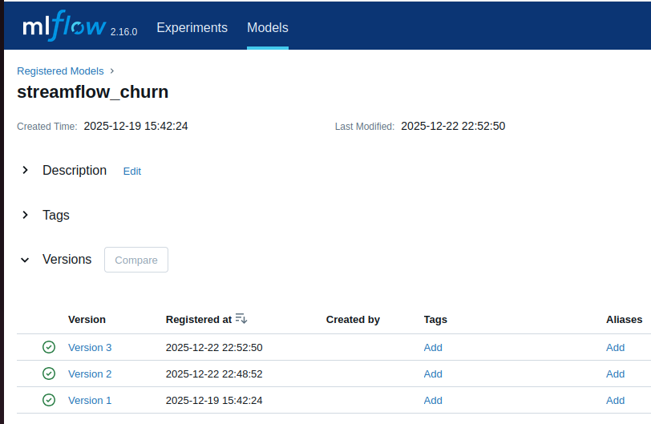

**Question 3.d**
**Question 3.e**
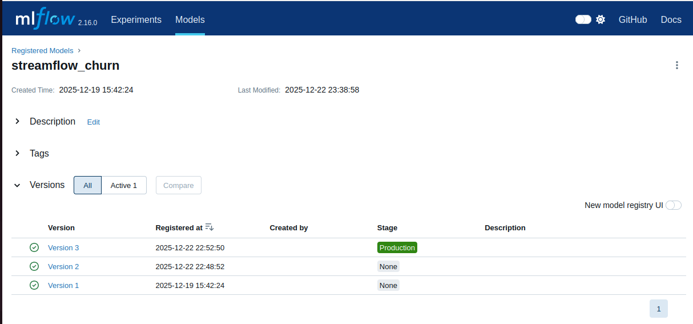
Nous avons vérifié qu’une seule version est en Production :

Nom du modèle : streamflow_churn 
Version en Production : 3

La version 3 est désormais la version active dans le registre de modèles et servira les prédictions de l'API.

**Question 3.f**
Run MLflow avec métriques et artefacts visibles:
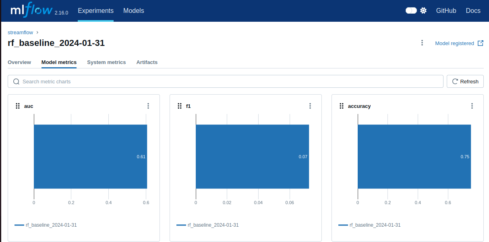
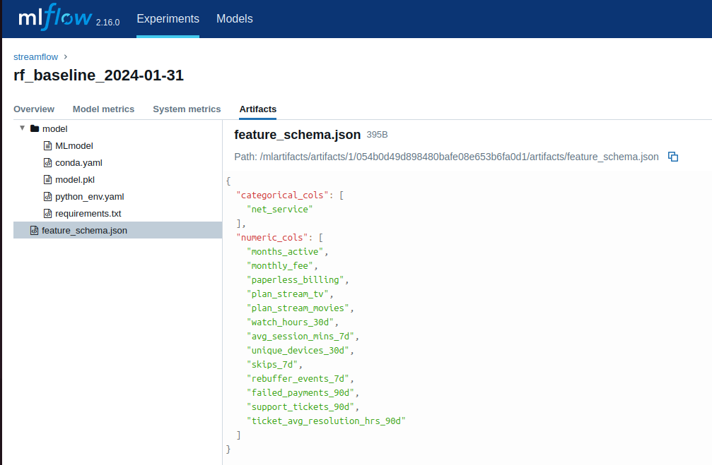
Model Registry avec le modèle streamflow_churn en Production:

Numéro de version promu : 3

**Question 3.g**
pourquoi utiliser les stages plutôt que des fichiers locaux :
Promouvoir un modèle via l’interface MLflow avec les stages (Stages, None, Staging, Production) permet de centraliser
la gestion du cycle de vie du modèle. Contrairement à un déploiement manuel basé sur des fichiers locaux, cela garantit :
- que l’on sait exactement quelle version est en production,
- que le modèle utilisé est tracé avec ses paramètres, métriques et artefacts,
- que l’on peut revenir facilement à une version précédente ou tester une version en Staging,
- une meilleure reproductibilité et sécurité pour les systèmes ML en production.
Cette approche réduit considérablement les risques d’erreurs humaines et de divergence entre entraînement et serving.

**Exercice 4 – Étendre l’API pour exposer /predict**
**Question 4.a**
fichier requirements.txt  mis à jour 

**Question 4.b**
fichier .env mis à jour 

**Question 4.c**
fichier app.py mis à jour

**Question 4.d**
Pour le redémarrage d'API les commandes exécutées sont : 
$ docker compose build api
$ docker compose up -d api

et pour vérifier accessibilité :

$ curl http://localhost:8000/health

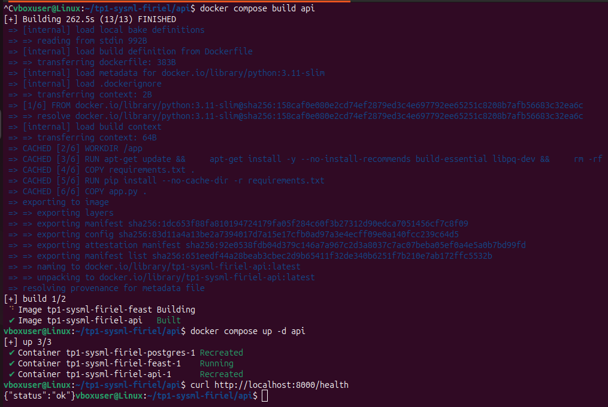

**Question 4.e**
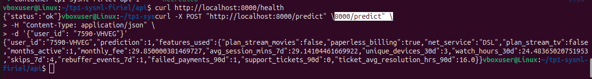

**Question 4.f**
Commande Swagger depuis http://localhost:8000/docs : 
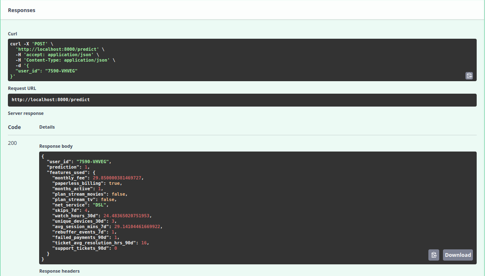

Commande curl utilisée :

curl -X POST "http://localhost:8000/predict" \
-H "Content-Type: application/json" \
-d '{"user_id": "7590-VHVEG"}'

**Question 4.g**

## Explication 
Charger le modèle depuis le MLflow Model Registry via models:/streamflow_churn/Production permet à l’API de bénéficier d’un point d’accès unique et fiable vers le modèle officiellement promu en production, plutôt que de dépendre d’un fichier local .pkl. Cette approche garantit que l’API utilise exactement la même version du modèle que celle validée et déployée, tout en assurant une traçabilité complète (version du modèle, métriques associées, paramètres et artefacts d’entraînement). Elle offre également la possibilité de mettre à jour ou remplacer le modèle en Production directement depuis MLflow, sans nécessiter de modification du code de l’API ni de redéploiement applicatif. Enfin, ce mécanisme renforce la cohérence entre le modèle, les features utilisées à l’entraînement et celles exposées en serving, tout en améliorant la reproductibilité globale et la sécurité du pipeline de machine learning.

**Exercice 5 – Robustesse du serving : cas d’échec réalistes (sans monitoring)**
**Question 5.a**
Requête avec curl : 

curl -X POST http://localhost:8000/predict \:8000/predict \
  -H "Content-Type: application/json" \
  -d '{
    "user_id": "7590-VHVEG"
  }'
  
Réponse JSON obtenue:

{"user_id":"7590-VHVEG","prediction":1,"features_used":{"monthly_fee":29.850000381469727,"paperless_billing":true,"months_active":1,"plan_stream_movies":false,"plan_stream_tv":false,"net_service":"DSL","skips_7d":4,"watch_hours_30d":24.48365020751953,"unique_devices_30d":3,"avg_session_mins_7d":29.14104461669922,"rebuffer_events_7d":1,"failed_payments_90d":1,"ticket_avg_resolution_hrs_90d":16.0,"support_tickets_90d":0}}

**Question 5.b**
Requête avec curl : 

curl -X POST http://localhost:8000/predict \
  -H "Content-Type: application/json" \
  -d '{
    "user_id": "999999"
  }'

Réponse JSON obtenue:

{"error":"Missing features for user_id=999999","missing_features":["monthly_fee","paperless_billing","months_active","plan_stream_movies","plan_stream_tv","net_service","skips_7d","watch_hours_30d","unique_devices_30d","avg_session_mins_7d","rebuffer_events_7d","failed_payments_90d","ticket_avg_resolution_hrs_90d","support_tickets_90d"]}

Observation de comportement de l'api : 
Le user_id n’existe pas dans l’online store, Feast retourne des valeurs nulles, le garde-fou dans l’API détecte ces valeurs manquantes et l’API refuse de prédire et retourne une erreur explicite.

**Question 5.c**
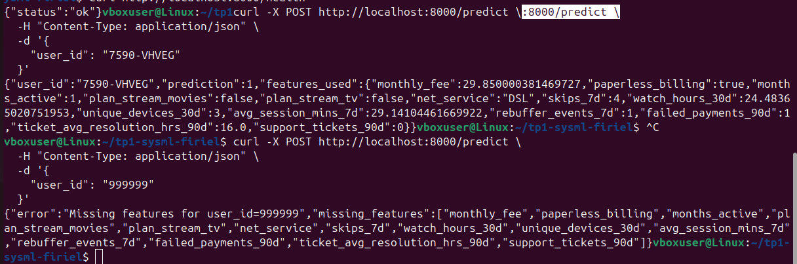

En production, les échecs liés au modèle sont très souvent dus aux features et non au modèle lui-même. Un premier problème fréquent est l’entité absente, c’est-à-dire lorsque l’user_id demandé n’est pas présent dans l’online store. Dans ce cas, Feast peut retourner des valeurs nulles pour certaines features, ce qui conduit le modèle à recevoir un input incomplet. Une prédiction dans ces conditions serait peu fiable et potentiellement dangereuse. Pour détecter ce problème tôt, l’API vérifie systématiquement la présence de valeurs manquantes avant d’appeler le modèle et bloque la prédiction si nécessaire.

Un second problème courant est un online store incomplet ou obsolète. Même si l’entité existe, la matérialisation des features peut ne pas avoir été exécutée ou certaines features peuvent être obsolètes. Cela peut introduire un biais silencieux dans la prédiction si aucune vérification n’est effectuée. Là encore, le contrôle systématique des valeurs nulles côté API permet de détecter immédiatement les features manquantes et de retourner une erreur explicite, évitant ainsi des prédictions incorrectes.

Ces garde-fous simples, basés sur la détection des valeurs manquantes et des entités inconnues, permettent d’éviter des prédictions incohérentes, de rendre les erreurs visibles immédiatement et de sécuriser le serving sans mettre en place de monitoring avancé. Ils constituent une première ligne de défense indispensable pour maintenir la robustesse et la fiabilité d’une API de machine learning en production.

**Exercice 6 – Réflexion de synthèse (ingénierie MLOps)**
**Question 6.a.**
MLflow garantit que chaque entraînement est complètement traçable. Concrètement, pour chaque run on enregistre les paramètres utilisés (liste de features, hyperparamètres du RandomForest, date AS_OF), les métriques de performance (AUC, F1, Accuracy) et les artefacts associés (pipeline préprocessing + modèle, fichier JSON des colonnes catégorielles et numériques). Cette traçabilité permet de reproduire exactement un entraînement, de comparer les runs et de retrouver un modèle précis correspondant à un jeu de données et des paramètres donnés.

Au niveau des modèles servis, MLflow fournit le Model Registry qui identifie chaque version de modèle par un numéro unique et permet de l’associer à un stage (None, Staging, Production). Cela garantit que l’API charge exactement la version désirée, sans ambiguïté sur le fichier ou l’artefact à utiliser, et permet de contrôler le cycle de vie du modèle (tests, promotion, retrait).

**Question 6.b.**
Le stage Production indique à l’API quel modèle utiliser pour générer des prédictions en conditions réelles. Au démarrage l’API interroge le Model Registry et charge automatiquement la dernière version du modèle promue en Production plutôt que d’utiliser un fichier local ou un artefact temporaire.

Côté déploiement, cela permet d’assurer une cohérence et une sécurité maximale, seules les versions validées et testées peuvent être servies. On évite ainsi d’exposer des modèles expérimentaux ou obsolètes. La promotion d’une version dans Production est donc un garde-fou opérationnel, qui centralise la décision et simplifie la maintenance de l’API.

**Question 6.c.**
Malgré MLflow, certaines ruptures de reproductibilité sont possibles :
- Données : si le snapshot ou l’online store Feast n’est pas correctement matérialisé, ou si des features sont manquantes ou obsolètes, le dataset d’entraînement ou la prédiction API peut varier.
- Code : des changements dans le script train_baseline.py ou dans les dépendances (versions de scikit-learn, pandas, etc.) peuvent modifier le comportement du modèle.
- Environnement : différences entre conteneurs Docker (versions Python, librairies système), ou configuration des services (Postgres, MLflow) peuvent affecter l’exécution.
- Paramètres non versionnés : si certaines variables d’environnement (AS_OF, random_state, chemin du repo Feast) sont modifiées sans être tracées, le run ne sera plus strictement reproductible.
- Artefacts externes : fichiers ou assets non stockés dans MLflow (ex. snapshots de features hors Feast) peuvent introduire des écarts entre runs.

En résumé, MLflow apporte une traçabilité solide, mais la reproductibilité complète dépend encore de la cohérence des données, du code et de l’environnement.
