## CI5 : Monitoring et observabilité
**Exercice 1 : Démarrer la stack pour l'observabilité**

**Question 1.a**

Le fichier docker-compose.yml est mis à jour.

**Question 1.b**

fichier services/prometheus/prometheus.yml est crée.

**Question 1.c**

j'ai créé la structure de répertoires nécessaire au provisioning de Grafana.

**Question 1.d**
La stack a été démarrée à l’aide de la commande docker compose up -d. La commande docker compose ps confirme que l’ensemble des services, notamment l’API, Prometheus et Grafana sont bien en cours d’exécution.

**Question 1.e**

Les interfaces web sont accessibles correctement. Prometheus est disponible sur http://localhost:9090 et Grafana sur http://localhost:3000. Prometheus interroge l’API via api:8000 car, dans Docker Compose, les conteneurs communiquent via le nom du service sur le réseau interne et non via localhost, qui ferait référence au conteneur Prometheus lui-même.

**Question 1.f**
Un court transcript terminal montrant docker compose up -d et/ou docker compose ps :
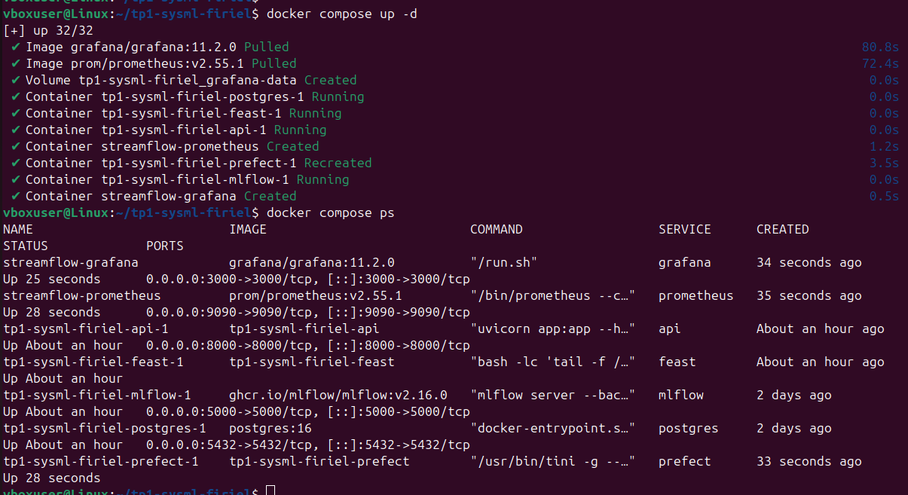

Une capture d’écran de la page d’accueil Prometheu : 
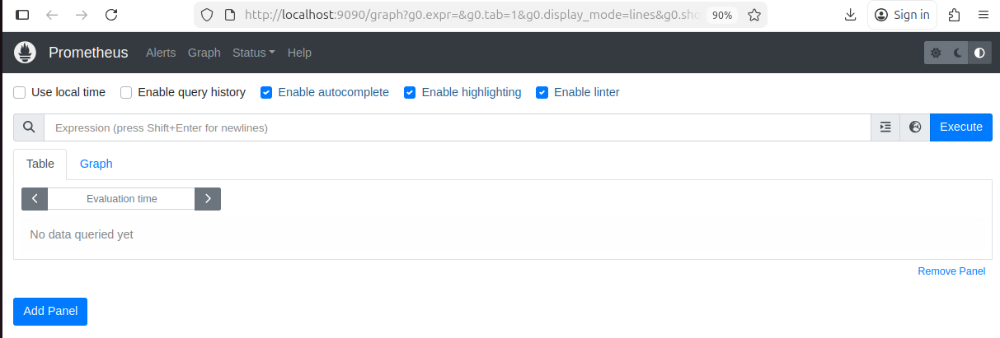

Une capture d’écran de l’écran de login ou d’accueil Grafana : 
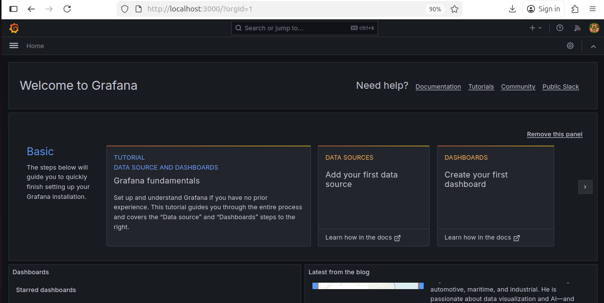

**Exercice 2 : Instrumentation FastAPI avec Prometheus**

**Question 2.a**
fichier api/app.py mis à jour 

**Question 2.b**
Démarre/re-démarre ton API : 
$ docker compose build api
$ docker compose up -d api

Vérifie l’endpoint /metrics :
$ curl http://localhost:8000/metrics

Appelle /predict plusieurs fois :
curl -X POST http://localhost:8000/predict \
-H "Content-Type: application/json" \
-d '{"user_id": "7590-VHVEG"}'

vérification finale l’endpoint /metrics avec :
$ curl -s http://localhost:8000/metrics | grep -E "api_requests_total|api_request_latency_seconds" 

Après avoir démarré l’API et appelé plusieurs fois l’endpoint /predict, j'ai vérifié l’endpoint /metrics. Le compteur api_requests_total augmente à chaque requête, et l’histogramme api_request_latency_seconds enregistre correctement la latence sur différents buckets, permettant d’analyser la distribution du temps de réponse.

**Question 2.c**
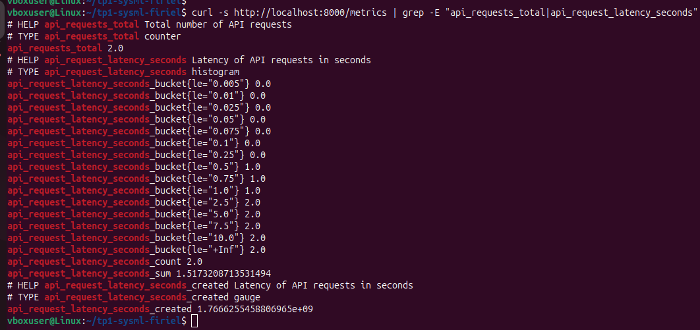

L’histogramme est plus utile qu’une simple moyenne car il permet de visualiser la distribution complète des latences, y compris les cas rares mais lents (tail latency). Une moyenne seule masquerait ces outliers, alors que l’histogramme permet de calculer des percentiles comme le p95 ou p99. Cela aide à détecter des dégradations silencieuses de performance que la moyenne ne ferait pas ressortir.

**Exercice 3 : Exploration de Prometheus (Targets, Scrapes, PromQL)**

**Question 3.a**
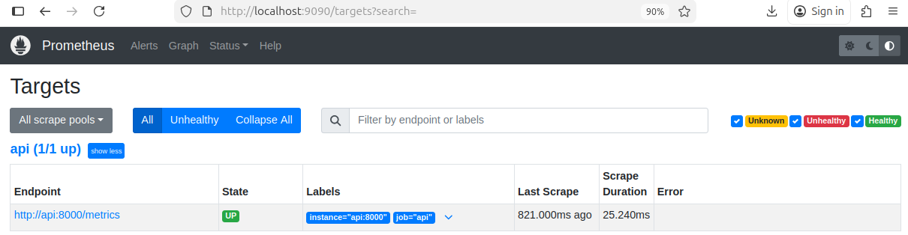

J'ai vérifié dans Prometheus que le job api est bien en état UP, et que la dernière scrappe a été réalisée récemment. Cela confirme que Prometheus peut collecter régulièrement les métriques exposées par l’API sur l’endpoint /metrics.

**Question 3.b**
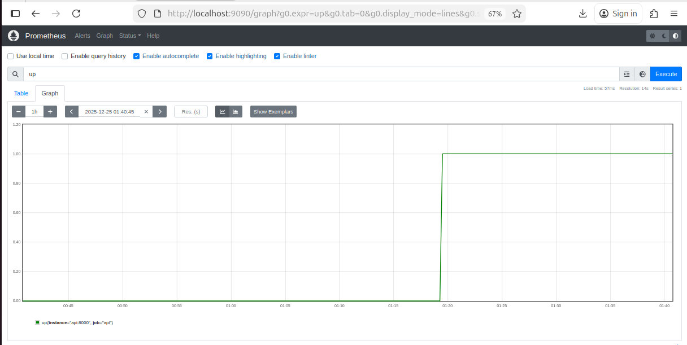
up : Retourne 1 si la cible est UP, 0 sinon. Permet de vérifier rapidement que toutes les cibles surveillées sont accessibles.

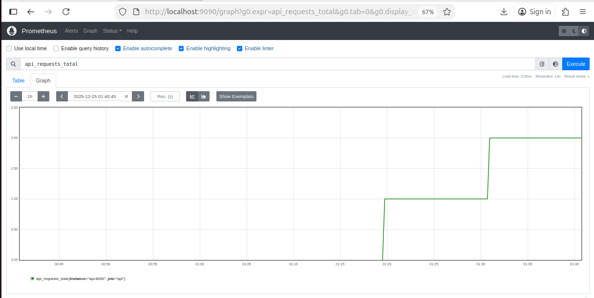
api_requests_total : Affiche le compteur total de requêtes reçues par l’API. On voit le cumul de toutes les requêtes depuis le démarrage du compteur.

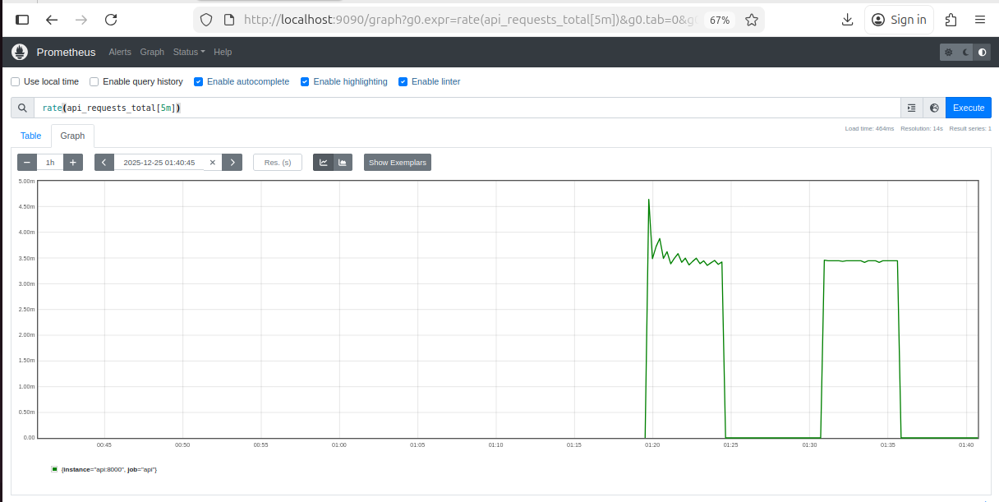
rate(api_requests_total[5m]) : Calcule le taux de requêtes par seconde sur les 5 dernières minutes. Utile pour observer le trafic récent et détecter des pics ou creux d’activité.

Interprétation: up confirme que la cible de l’API est accessible. api_requests_total montre le nombre cumulé de requêtes reçues, tandis que rate(api_requests_total[5m]) permet d’observer le trafic récent par seconde. Ces informations sont utiles pour vérifier le bon fonctionnement de l’API et détecter d’éventuelles anomalies de trafic.

**Question 3.c**
après exécution de Requête dans Prometheus : rate(api_request_latency_seconds_sum[5m]) / rate(api_request_latency_seconds_count[5m])

on a eu ce résultat : 
{instance="api:8000", job="api"}
	0.47980427742004395

La valeur affichée ici 0.47980427742004395 secondes correspond au temps moyen de traitement d’une requête API sur les 5 dernières minutes. Elle permet de suivre la performance de l’API et de détecter d’éventuelles dégradations de latence lorsqu’on génère du trafic.

**Question 3.d**

Capture Status → Targets : 

capture d’un graph Prometheus pour rate(api_requests_total[5m])

**Exercice 4 : Setup de Grafana et dashboard minimal**

**Question 4.a**
J'ai configuré Prometheus comme datasource dans Grafana en pointant vers http://prometheus:9090. Cela permet à Grafana de récupérer toutes les métriques exposées par l’API et de les visualiser dans des dashboards interactifs.

**Question 4.b**
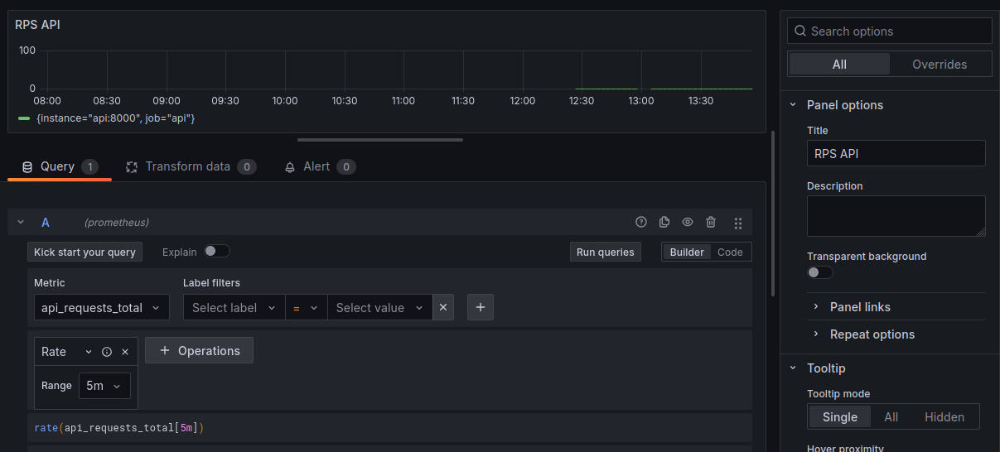

Ce panel affiche le nombre de requêtes par seconde (RPS) pour l’API sur une fenêtre de 5 minutes glissante. Il permet de visualiser le trafic en temps réel et de détecter rapidement des pics ou des creux d’activité.

**Question 4.c**
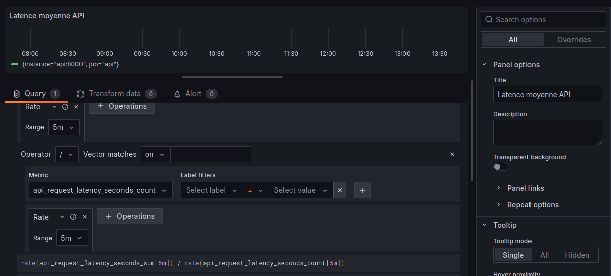
Ce panel montre l’évolution de la latence moyenne par requête sur les 5 dernières minutes. Cela permet d’identifier des ralentissements de l’API lorsque le trafic augmente ou en cas de dégradation du système.

**Question 4.d**
appel l'endpoint/predict : 
for i in {1..100}; do
  curl -s -X POST http://localhost:8000/predict \
  -H "Content-Type: application/json" \
  -d '{"user_id":"U0001"}' > /dev/null
done

Le panel RPS montre un pic correspondant aux requêtes générées : 
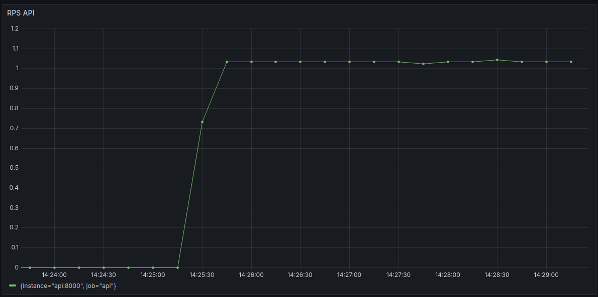

**Question 4.e**
Dashboard complet avec pic de trafic visible : 

Éditeur de requête d’un panel (promQL visible):
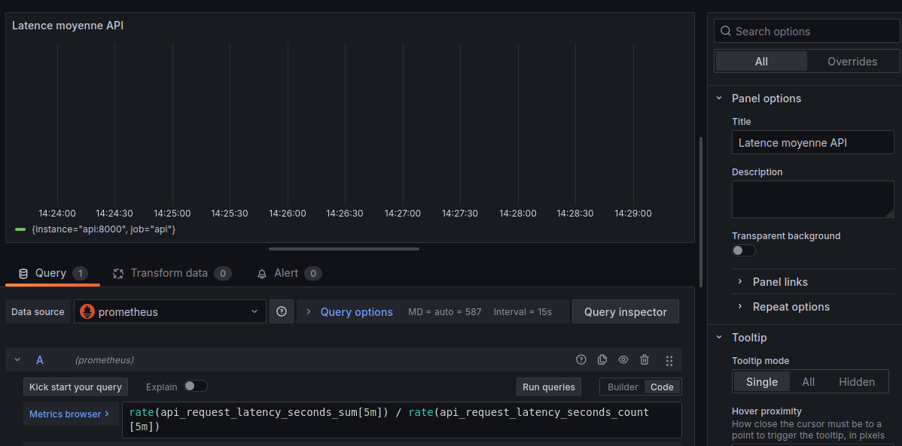

En générant du trafic sur l’API, nous observons que le panel RPS reflète parfaitement le volume de requêtes, tandis que le panel de latence montre l’impact sur le temps moyen de réponse. Ces métriques permettent de détecter des anomalies de trafic ou de performance, mais elles ne renseignent pas sur la qualité des prédictions du modèle. Pour cela, un monitoring des résultats ou du drift de données serait nécessaire.

**Exercice 5 : Drift Detection with Evidently (Month_000 vs Month_001)**

**Question 5.a.**
fichier services/prefect/monitor_flow.py complet.

**Question 5.b.**
Aprés l'exécution du script tout est bon !

**Question 5.c.**
Capture du rapport Evidently (HTML)
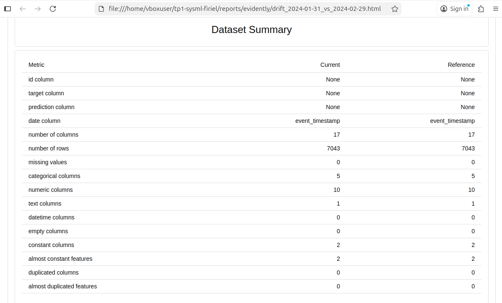

Différence entre covariate drift et target drift:
Le covariate drift correspond à une évolution de la distribution des variables d’entrée du modèle (features) entre deux périodes.
Dans ce projet, il permet de détecter si le comportement des utilisateurs change au fil du temps.
Le target drift, quant à lui concerne la variable cible (churn_label) et mesure une évolution du taux de churn entre deux périodes.
Le covariate drift peut apparaître sans impact immédiat sur la cible, alors que le target drift indique directement un changement métier critique.

Ligne de décision finale :
[Evidently] report_html=/reports/evidently/drift_2024-01-31_vs_2024-02-29.html report_json=/reports/evidently/drift_2024-01-31_vs_2024-02-29.json drift_share=0.06 -> NO_ACTION drift_share=0.06 < 0.30 (target_drift=0.0)

