# CI6 : CI/CD pour systèmes ML + réentraînement automatisé + promotion MLflow
**Exercice 1 : Mise en place du rapport et vérifications de départ**

**Question 1.a**

**Question 1.b**


Les logs confirment que l’API démarre sans erreur et que les services sont opérationnels.
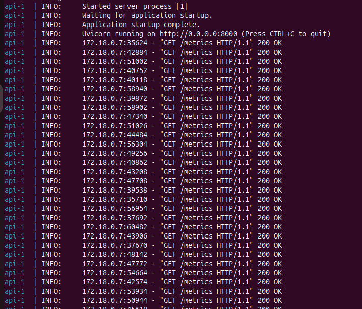

**Question 1.c**
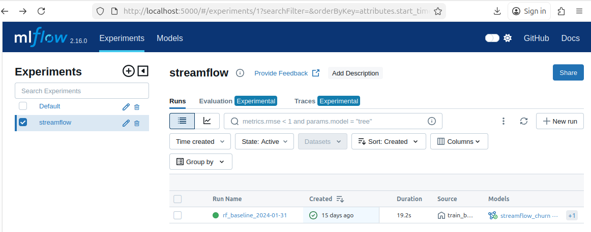
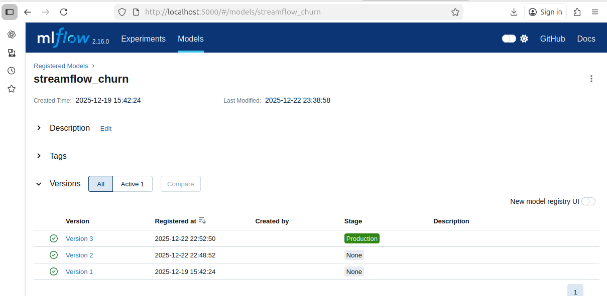

**Question 1.d**

Un transcript terminal montrant docker compose up -d et docker compose ps : 

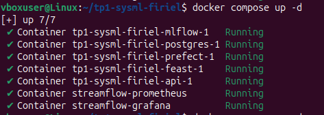


Une capture MLflow montrant la version Production au début du TP:


**Exercice 2 : Ajouter une logique de décision testable (unit test)**
**Question 2.a** 
fichier nano services/prefect/compare_utils.py crée :  
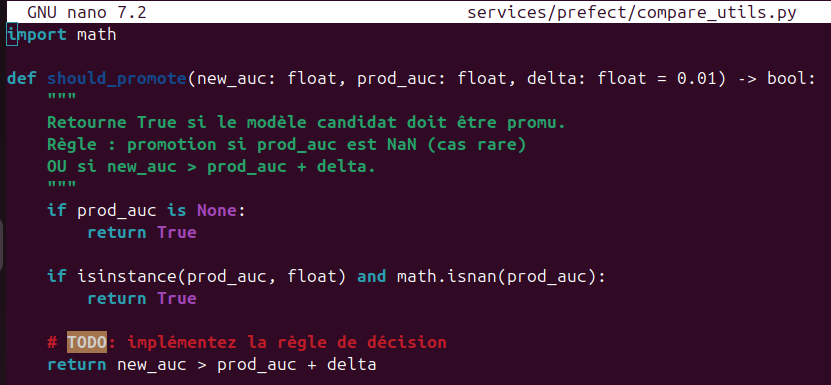

**Question 2.b** 
fichier tests/unit/test_compare_utils.py crée 

**Question 2.c** 
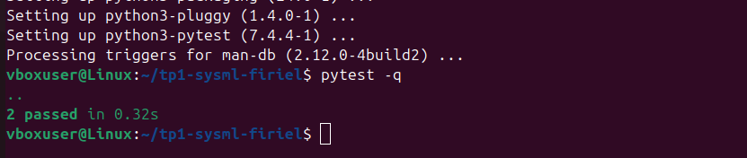

**Question 2.d** 

### 2. Tests unitaires de la logique de promotion

Les tests unitaires ont été exécutés localement à l’aide de pytest :

```
vboxuser@Linux:~/tp1-sysml-firiel$ pytest -q
..                                                                                                               [100%]
2 passed in 0.32s

```


## pourquoi on extrait une fonction pure pour les tests unitaires : 

La logique de décision de promotion a été extraite dans une fonction pure afin de pouvoir être testée de manière simple et fiable.  
Tester directement Prefect ou MLflow introduirait des dépendances lourdes (services externes, état du registry, environnement Docker), ce qui rendrait les tests fragiles et difficiles à maintenir.

En isolant la règle métier dans une fonction indépendante, on garantit des tests rapides, déterministes et faciles à comprendre, tout en sécurisant un point critique du pipeline MLOps, la décision de promotion d’un modèle.

**Exercice 3 : Créer le flow Prefect train_and_compare_flow (train → eval → compare → promote)**

**Question 3.a.**

fichier services/prefect/train_and_compare_flow.py crée

**Question 3.b.**
commande lancée `$ docker compose exec prefect python train_and_compare_flow.py` 

résultat :

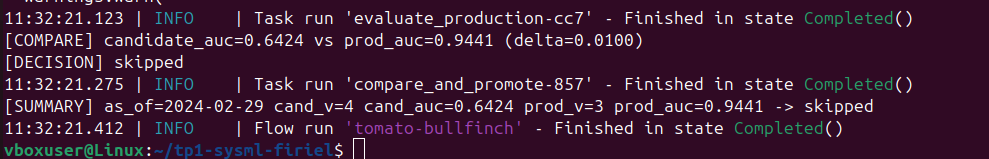

**Question 3.c.**

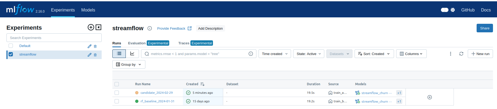
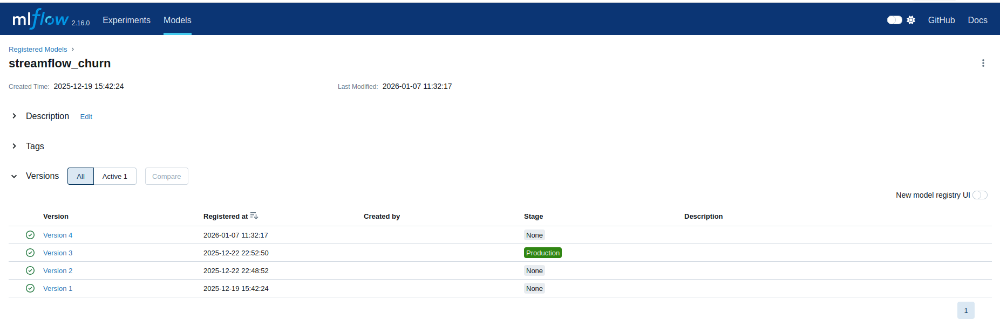
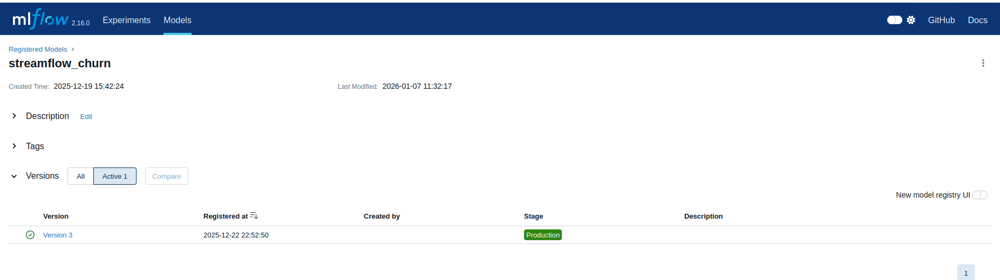

**Question 3.d.**
Extrait des logs :
```
11:32:21.123 | INFO    | Task run 'evaluate_production-cc7' - Finished in state Completed()
[COMPARE] candidate_auc=0.6424 vs prod_auc=0.9441 (delta=0.0100)
[DECISION] skipped
11:32:21.275 | INFO    | Task run 'compare_and_promote-857' - Finished in state Completed()
[SUMMARY] as_of=2024-02-29 cand_v=4 cand_auc=0.6424 prod_v=3 prod_auc=0.9441 -> skipped
11:32:21.412 | INFO    | Flow run 'tomato-bullfinch' - Finished in state Completed()

```


Une capture de l'interface MLflow montre qu'une nouvelle version 4 a été crée, tandis que la version précédente a été automatiquement archivée. Cependant, la nouvelle version n'est pas déployée en production car ses performances sont moins bonnes que celles de l'ancien modèle. L'ancien modèle reste donc en production et le statut de la nouvelle version reste sur "None".


## Une phrase expliquant pourquoi on utilise un delta :
L’utilisation d’un delta permet d’éviter de promouvoir un modèle pour des gains de performance insignifiants.  
Dans un contexte réel, de petites variations d’AUC peuvent provenir du bruit statistique ou du split des données, et ne traduisent pas une amélioration réelle du modèle.

En imposant un seuil minimal d’amélioration, on garantit que la promotion en Production correspond à un gain mesurable et stable, ce qui limite les changements inutiles et renforce la fiabilité du pipeline MLOps.

**Exercice 4 : Connecter drift → retraining automatique (monitor_flow.py)**

**Question 4.a.**

fichier services/prefect/monitor_flow.py mis à jour.

**Question 4.b.**

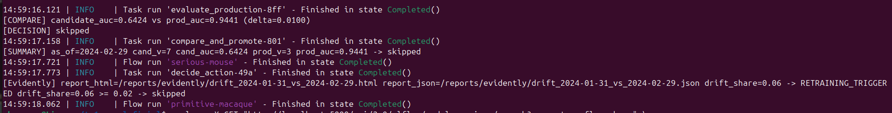
Décision : drift_share=0.06 >= 0.02 → Retraining déclenché !

**Question 4.c.**

Une capture (ou extrait) du rapport Evidently HTML (fichier reports/evidently/drift_*.html) :

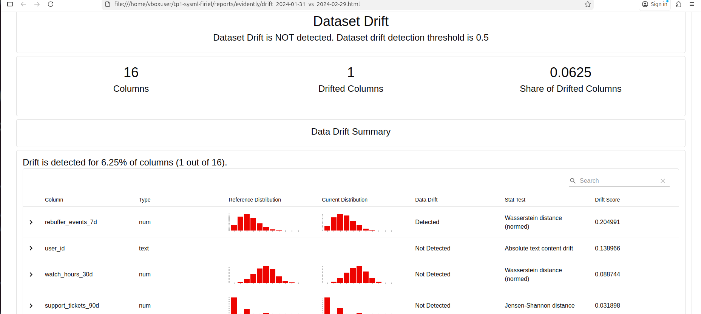

Un extrait de logs montrant le message RETRAINING_TRIGGERED ... et le résultat promoted/skipped : 


Un drift de 6% a été détecté, dépassant le seuil de 2%. Un réentraînement a donc été déclenché, produisant un nouveau modèle. Cependant, ce modèle présente une performance dégradée (AUC=0.6424) comparée au modèle de production (AUC=0.9441). Conformément à la politique de déploiement, le modèle n'est pas promu (delta=0.01 non atteint). Ce comportement assure que seule une amélioration avérée des performances justifie le remplacement du modèle en production.

**Exercice 5 : Redémarrage API pour charger le nouveau modèle Production + test /predict**

**Question 5.a.** 

**Question 5.b.** 
Récupération d’un user_id réel : $ head -n 2 data/seeds/month_000/users.csv

Appel curl :

```
curl -s -X POST "http://localhost:8000/predict" \
  -H "Content-Type: application/json" \
  -d '{"user_id":"7590-VHVEG"}'
  
```
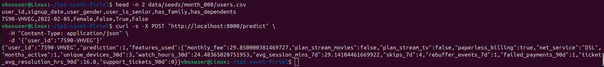

**Question 5.c.** 

Un transcript curl montrant la réponse JSON : 


## Une phrase expliquant pourquoi l’API doit être redémarrée :

L'API doit être redémarrée car elle charge le modèle depuis MLflow au démarrage via models:/streamflow_churn/Production. Lorsqu'un nouveau modèle est promu en production dans MLflow, l'API continue d'utiliser l'ancien modèle chargé en mémoire. Un redémarrage force le rechargement avec la nouvelle version.

**Exercice 6 : CI GitHub Actions (smoke + unit) avec Docker Compose**
 
**Question 6.a.**

**Question 6.b.**

git add .
git commit -m "Add GitHub Actions CI workflow"
git push origin main

**Question 6.c.**

# Une capture GitHub Actions montrant un run qui passe : 


# Une phrase expliquant pourquoi on démarre Docker Compose dans la CI (tests d’intégration multi-services):
Docker Compose est démarré dans la CI pour effectuer des tests d'intégration multi-services. Cela permet de vérifier que tous les composants (API, MLflow, Feast, PostgreSQL) peuvent communiquer correctement ensemble et que l'API reste fonctionnelle après déploiement.

**Exercice 7 – Synthèse finale : boucle complète MLOps**

**Question 7.a – Synthèse**
- Comment le drift est mesuré et le rôle du seuil 0.02 (en pratique, plus élevé)
- Comment le flow train_and_compare_flow compare val_auc et décide une promotion
- Ce qui relève de Prefect vs GitHub Actions

Dans ce TP, nous avons mis en place une boucle MLOps complète allant de la détection de dérive jusqu’au serving du modèle en production.
Le drift est mesuré à l’aide d’Evidently, qui compare les distributions de features entre un mois de référence et un mois courant. Le seuil de 0.02 utilisé ici est volontairement bas pour forcer le déclenchement dans un cadre pédagogique, mais en pratique il serait ajusté selon les risques métier et la stabilité attendue du modèle.

Lorsqu’un drift significatif est détecté, le flow train_and_compare_flow est déclenché automatiquement via Prefect. Ce flow entraîne un modèle candidat, évalue ses performances (notamment l’AUC) sur un jeu de validation, puis compare ces résultats à ceux du modèle actuellement en Production. La promotion est décidée uniquement si le gain dépasse un delta défini, ce qui évite les promotions inutiles ou dues au bruit.

Prefect est responsable de l’orchestration des flows métiers (monitoring, entraînement, comparaison, promotion), tandis que GitHub Actions gère la validation du code via la CI, en s’assurant que les tests unitaires et les démarrages des services fonctionnent correctement avant toute intégration.

**Question 7.b – Limites / améliorations**
- Pourquoi la CI ne doit pas entraîner le modèle complet
- Quels tests manquent
- Pourquoi l’approbation humaine / gouvernance est souvent nécessaire en vrai

La CI ne doit pas entraîner de modèle complet car ce type de tâche est coûteux, lent et non déterministe, ce qui va à l’encontre des objectifs d’une intégration continue rapide et fiable.

Plusieurs tests pourraient être ajoutés, notamment des tests contractuels sur les features, des tests de cohérence entre offline et online store, ou encore des tests de performance du modèle.

Enfin, dans un contexte réel, une promotion automatique vers Production est rarement totalement autonome. Des étapes de validation humaine, de revue métier ou de gouvernance sont souvent nécessaires, en particulier lorsque les décisions du modèle ont un impact fort sur les utilisateurs ou l’entreprise.

**Question 7.c Pushez votre dépôt avec le tag TP6.**


